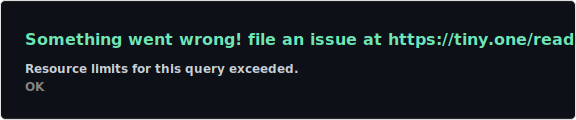

<div align="center">

[](https://git.io/typing-svg)

<br/>

[](https://linkedin.com/in/gabriel-cirqueira-barbosa)
[](https://linktr.ee/GabrielCirqueira)
[](https://cirqueira.com/)
[](mailto:gabrielcirqueira711@gmail.com)

</div>

---

## 👨‍💻 Sobre mim

```yaml
name:     Gabriel Cirqueira Barbosa
location: Pinheiros, ES — Brasil
role:     Full Stack Developer
company:  Moveis Simonetti
focus:    Back-end · APIs REST · Interfaces modernas
```

Desenvolvedor apaixonado por tecnologia e programação. Busco constantemente desafios e oportunidades de aprendizado para evoluir no campo da tecnologia.

---

## 🛠️ Tecnologias

**Back-end**


**Front-end**


**DevOps & Ferramentas**


---

## 📊 Estatísticas

<div align="center">
  
  
</div>

---

## 🐍 Contribuições

<div align="center">
  <picture>
    <source media="(prefers-color-scheme: dark)" srcset="./profile/snake-dark.svg">
    <source media="(prefers-color-scheme: light)" srcset="./profile/snake.svg">
    
  </picture>
</div>

---

<div align="center">
  <sub>📍 Pinheiros, ES · gabrielcirqueira711@gmail.com</sub>
</div>
